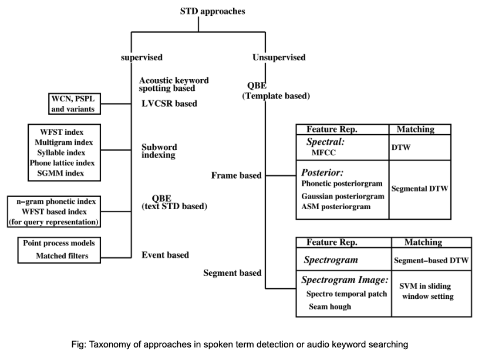

<h1 align="center"> Project – Audio keyword spotting </h1>

## Problem Statement

The problem of audio keyword spotting (AKS), also known as spoken term detection (STD), is basically a search problem in the acoustic domain. Several speech applications, developed to integrate into our daily lives, utilize the audio keyword spotting module to interact with humans and produce desired response. The keyword spotting requires searching and locating a particular spoken term in a relatively larger space of audio signals. The problem also provides efficient measures for context-based indexing of speech signals. 

## Introduction 

AKS can also be sometimes seen as an auxiliary task for automatic speech recognition (ASR) systems. However, there is a fine distinction between the two tasks. AKS requires detection of a particular word or phrase in an utterance, while ASR incorporates a language model to give a complete transcript of the utterance. It is also true that a majority of approaches for AKS are derived from solutions pertaining to the ASR domain, with necessary modifications. The supervised approach for AKS employ techniques such as query by example (QBE) text based detection, or large vocabulary continuous speech recognition (LVCSR), the unsupervised methods utilize QBE using frame–based or segment–based template matching.  

## Issues with LVCSR

- Even for well resourced languages, there are challenges with using LVCSR technology. 
- The spoken term quite often contains multilingual words which are difficult to model.
- These words become out–of–vocabulary (OOV) words for the vernacular language.
- The dependence of LVCSR on language models make it difficult to adapt to spoken query.

## QBE based methods

- The keyword or the spoken term is introduced by speech.
- These methods have very little, or no requirement of annotated speech data, or prior knowledge of the underlying language 
- Quite effective in context of low resource languages and even with OOV words.
- Supervised QBE approaches use phone lattice representations of keyword exemplars to be matched against similar representation of the target utterance.
- These methods do not require a phonetic lexicon for the queried keywords but require labeled resources for building lattices.
- Unsupervised QBE work on the template matching paradigm where template is created for a query and similarity match based on some measure is performed in the target utterance.
- For template matching, almost all methods use some or the other variant of DTW

## In this project

- We learn to parameterize speech based on different paradigms 
- We approach audio keyword spotting through supervised and unsupervised QBE based methods
- We understand the nuances of using LVCSR based AKS 
- We derive measures to improve AKS score by fusion of different parameters 

