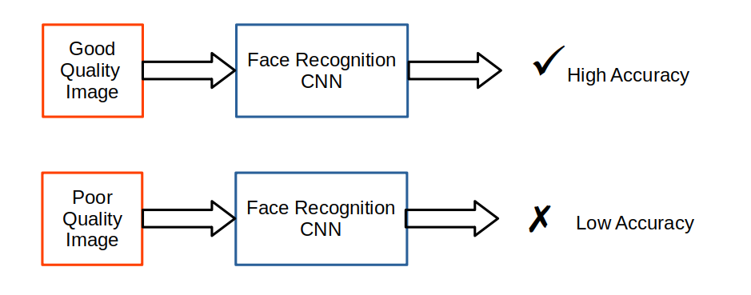
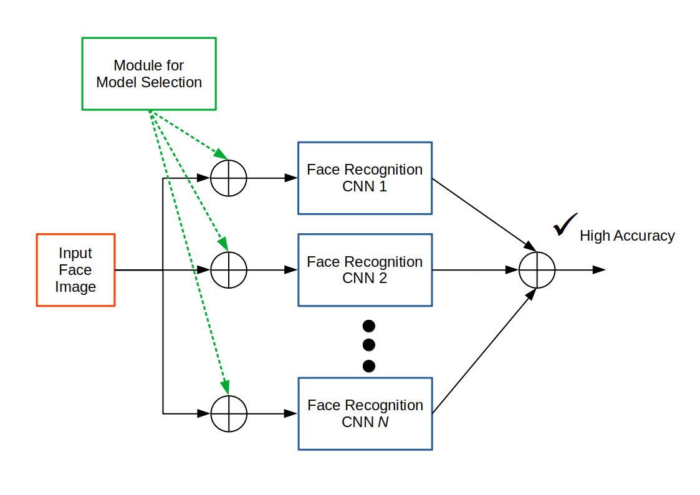

<h1 align="center"> Recommendation of Face Recognition Models for poor face images</h1>

Recommendation of face recognition models for poor quality face images  
Mentor: *Dr Ketan Kotwal*

## Statement

Today's face recognition systems are highly accurate. Given an image of face, 
the recognition system can identify the person (if they are already registered in the system). 
However, the accuracy degrades significantly when the face image is blurred or noisy. 
See figure below:

You are supposed to study performance of different face recognition CNNs (deep networks) against 
a variety of degraded images (from standard datasets), and suggest which recognition models 
are effective for a given degradation.

This problem can be split into:

- simulate different blur and noise degradations of face images
- obtain recognition results using several face recognition models (we will select few latest models)
- analyze the performance (noise v/s model) and recommend which models work best for specific degradation of images
- [optionally, to continue later as a research problem:] develop an automatic model selection method. 
This method will analyze the face image (or its degradation), and suggest the recognition model to be used. 
This model will function as shown in figure below:

