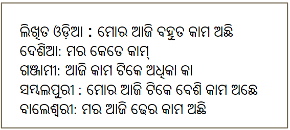

# Odia Dialect Corpus

Mentor: Dr. Shantipriya Parida 
Team Name: XXX 
Team Leader Name: Aniket Dash 

Mamber1 :  
Name : Aniket Dash 
Institute Name: International Institute of Information Technology (IIIT),Bhubaneswar 
Current Education : BTech in Computer Engineering 

## Overview
Language detection is a key part of the NLP pipeline for text processing. The task of automatically detecting languages belonging to disjoint groups is relatively easy. It is considerably challenging to detect languages that have similar origins or dialects. Although dialect identification is commonly based on the distributions of letters or letter n-grams, it may not be possible to distinguish related dialects with very similar phoneme and grapheme inventories for some languages.

Although Odia written script is same but there are many dialects available (as per wiki) shown below.

## Major forms or dialects
* Midnapori Odia: Spoken in the undivided Midnapore and Bankura Districts of West Bengal.
* Singhbhumi Odia (Major Dialect): Spoken in East Singhbhum, West Singhbhum and Saraikela-Kharsawan district of Jharkhand
* Baleswari Odia: Spoken in Baleswar, Bhadrak and Mayurbhanj district of Odisha.
* Cuttacki Odia (Major Dialect): Spoken in Cuttack, Jajpur, Jagatsinghpur, Kendrapara and Dhenkanal districts of Odisha.
* Standard Odia (Official Register Dialect): Spoken in Puri, Khordha and Nayagarh districts of Odisha.
* Ganjami Odia(Major Dialect): Spoken in Ganjam and Gajapati districts of Odisha and Srikakulam district of Andhra Pradesh.
* Sambalpuri Odia or Odia(Major Dialect): It is the westernmost dialect of Odia language spoken in Sundargarh, Sambalpur, Jharsuguda, Bargarh, Balangir, Subarnapur and * Nuapada districts along with parts of Boudh, Anugul, Kendujhargarh and Nabarangapur districts of Odisha and in Raigarh, Mahasamund and, Raipur districts of Chhattisgarh state.
* Desiya Odia or Koraputia-Kalahandi Odia (Major Dialect): Spoken in Nabarangpur, Kalahandi, Rayagada, Koraput and Malkangiri districts of Odisha and in the hilly regions of Vishakhapatnam and, Vizianagaram districts of Andhra Pradesh. It also has significant speakers in Raipur , Bhilai and Bilaspur areas of Chhattisgarh[28]
* Phulbani Odia: spoken in Kandhamal and in parts of Boudh district .
* Bhatri: Spoken in South-western Odisha and eastern-south Chhattisgarh.
* Halbi: Spoken in undivided Bastar district of Chhattisgarh. Halbi is a mixture of Odia and Marathi with influence of Chhatishgarhi tribal languages.
* 'Berhampuriya Odia': Spoken mainly in Berhampur
* 'Laria/Chhattisgarhi': Spoken in mainly Chattisgarrh. This is transitional language between Odia and Hindi . Often considered as a major dialect of Odia. It is spoken in 25 districts of Chhattisgarh.

## Problem Statement :

As the written text follows the same Odia script, how to distinguish different dialects for many NLP applications (e.g. automatic identification of language for machine translation, text categorization) for different services.  Can machine learning techniques help to solve this ?.  

## Possible Solution:

As machine learning models can easily identify the language based on the input text, it can be possible to train a model using supervised machine learning approach with labeled data to identify language with dialect variation. But to train such models need labeled dataset which contain text and the corresponding dialect with label.

## Benefit:
The Odia dialect dataset will be helpful for many NLP researchers for research, and building NLP applications for specific dialects (Sambalpuri, Ganjami, Cuttacki, Desiya, Baleswari) which can be used by the people more familiar with their own dialect. 

## Proposed Approach:

1. Study the Odia dialects and find the major dialects such as:
   Sambalpuri Odia,  
   Ganjami Odia,
   Cuttacki Odia,
   Desiya Odia,
   Baleswari Odia

2. Collect monolingual data from various sources such as website, Books, Magazines, News paper using different computing techniques such as data scraping, OCR. The number of sentences required from each dialect is 1,000 approx. 

3. Preprocess the data to remove unnecessary noise, filter the data, verify by human native speaker experts.
   Noise patterns 
   Duplications 
   Stop word 
   Spelling errors 
   Mixed form usage 
 
4. Filter categories 
 
5. Labeled the text with dialect id.

   Text                                         |  Language_Id
   ---------------------------------------------|-------------
   ଆମର୍ ସମ୍ବଲପୁରୀ ଜେନ ଥିଲେଁବି ବାରିହେସି,ଝଲ୍'ସି ଉଠ୍'ସି । |  odia-sam
   XXXXX |  odia-gjm
   XXXXX | odia-ctc
   XXXXX | odia-dsy
   XXXXX | odia-bls 

6. Split the dataset into a train/dev/test set with proper documentation.

7. Train the model and prepare the baseline.
   Refer the [code](https://github.com/shantipriyap/Odia-Santali-Dialect-Detection-Dataset) and do the necessary changes to train the model.

8. Release the dataset (Future work)

