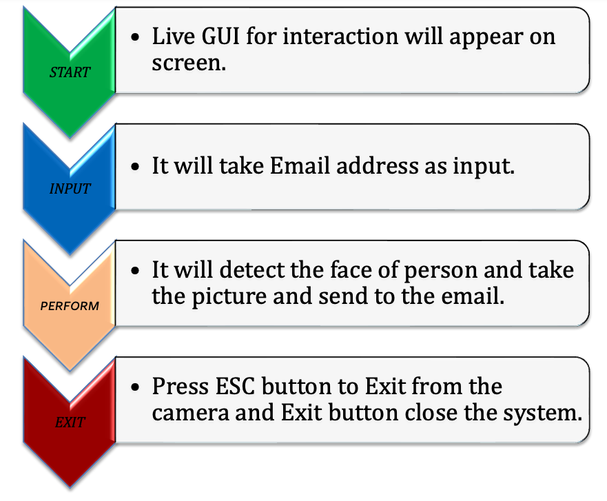
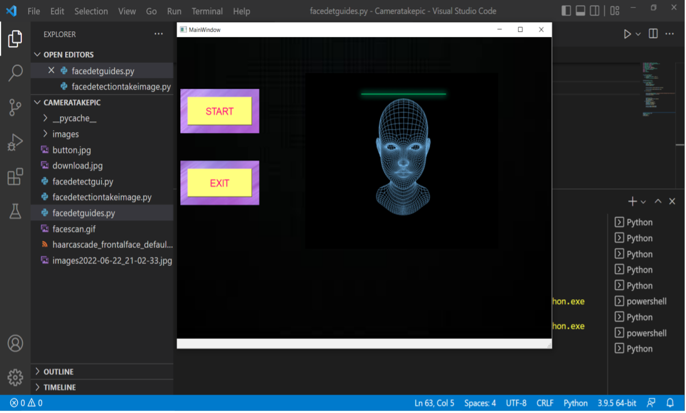
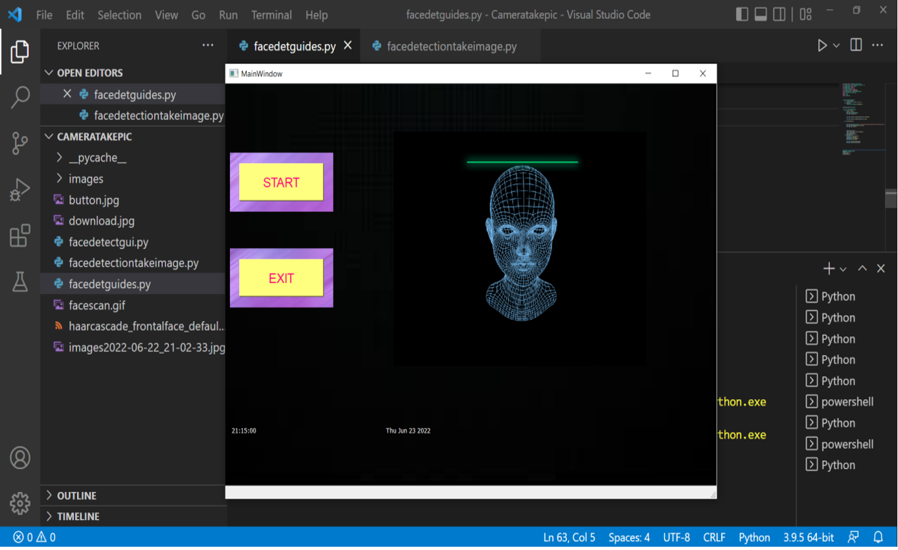
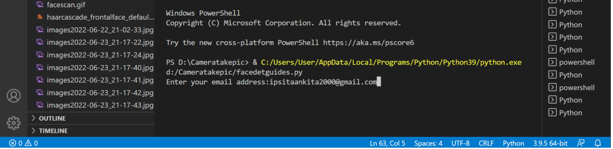
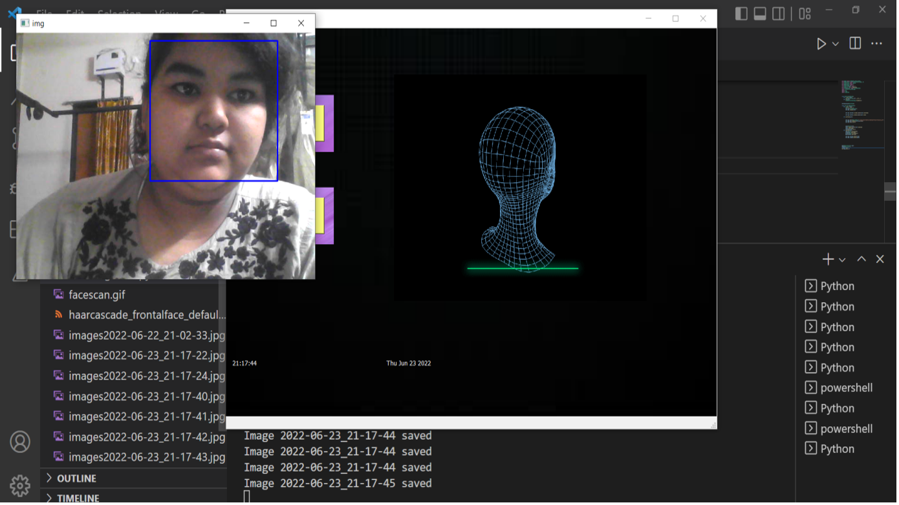
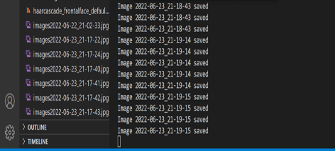

# Face detecting CCTV

*Aim of the project is - If anyone's face is detected by the camera it will send an email with their pictures and save the pictures on laptop /desktop automatically*

Mentor: Mr. Abhijeet Parida 

Team Leader : Ipsita Ankita Hota 

Members:3 

Member1 
Name : Punam patra  
Institute Name:Utkal university 
Current Education : IMCA 

Member2 
Name : Arpita Sahoo 
Institute Name:Utkal university 
Current Education: IMCA 

Member3 
Name : Ipsita Ankita Hota 
Institute Name:Utkal University 
Current Education :IMCA 

Face detecting CCTV is a platform where users can prevent themselves from robberies. The main aim of this project is if anyone’s face is detected by the camera it will send an email with their pictures and save the pictures on laptop or desktop automatically. For detecting CCTV system makes your laptop or desktop to a CCTV camera. When a Person is alone in his/her home he/she can go out without any worries by using our system. Our Project contains a GUI for better understanding, by clicking start it will start and the camera will be on if anyone enters to your room it will automatically detect the face and capture the image and will send it to your email. This concept of machine learning makes life easier.

## Problem Statement

In recent times technology is advanced. Many people fit CCTV cameras to protect their home but that is expensive and time consuming, a normal person can't afford it but if we made our laptop as a CCTV that would be a cost effective and reliable idea.

## Proposed System

The main aim of the proposed system is to prevent home from robberies. To fulfill the aim we are using cascade classifier which is useful to detect the face by passing the faces frame in a loop and we convert the camera capturing image to black white  for better face detection then the photo taken by the system directly send to the email you have given and also  saved in laptop or desktop too.

### Hardware Specifications

∙ Processor – Core i3 
∙ Clock speed – 1.9GHZ 
∙ RAM – 4GB 
∙ Mouse – 2 Button Mouse 
∙ Hard Disk – 1TB 
∙ Display – Video 1920*1080 color 

### Software Specifications

∙ Language used: Python
∙ Operating system: Windows 10 
∙ GUI Designer: QT Designer 
∙ Editor: VS Code 

## Flow Diagram

## Design

### GUI Interaction Page

 
### After start button press page

### Give email as input page

### Face detected page

### Face detected image saved page

### Email Sent page

## Conclusion

Much effort has been put into the system to make a user-friendly and interactive user interface and Helpful for the user safety. 

## Reference

- Google search
- YouTube
- [OpenCV GitHub](https://github.com/opencv/opencv/tree/master/data/haarcascades)

## Scope of future work

- Make our project show the live video through mobile phone recording in laptop or desktop.

- Add some call feature to emergency number automatically

