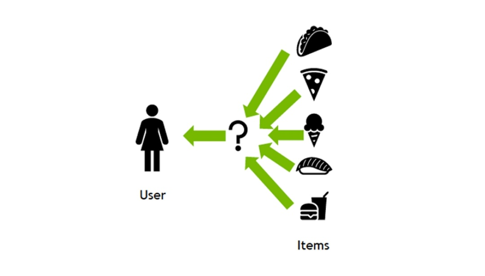
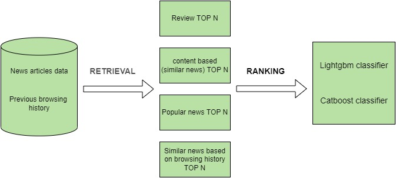

<h1 align="center">Recommendation System (RecSys)</h1>

  

 

RecSys (Recommender Systems) has become an important component in today's digital world.

 
It’s a vital component of many industries providing e-services ranging from news services(BBC), social media(facebook, twitter, tiktok etc) to online video streaming platforms(netflix, youtube etc).

 
 
RecSys captures user behaviour information and gives tailored suggestions to the user using a scalable end-to-end pipeline. A recommender system's purpose is to locate the products that are the most clickable (likeable) for a certain user. It accomplishes this by thoroughly evaluating the information acquired from user interactions, such as likes, clicks, watch times, purchases, and session-based product impressions. It should then rank them and show the user the top-N things. It is accomplished by calculating the probability of a certain item being clicked by a specific user. CTRs (Click Through Rate) estimations are the method for doing this.

Project Structure
------------

    ├── Makefile           <- Makefile with commands like `make data` or `make train`
    ├── README.md          <- The top-level README for developers using this project.
    ├── data
    │   ├── processed      <- The final, canonical data sets for modeling.
    │   └── raw            <- The original, immutable data dump.
    │
    ├── docs               <- A default folder for all Docs.
    │
    ├── models             <- Trained and serialized models, model predictions, or model summaries
    │
    ├── notebooks          <- Jupyter notebooks.
    │
    │
    ├── reports            <- Generated analysis as HTML, PDF, LaTeX, etc.
    │   └── figures        <- Generated graphics and figures to be used in reporting
    │
    ├── requirements.txt   <- The requirements file for reproducing the analysis environment, e.g.
    │                         generated with `pip freeze > requirements.txt`
    │
    ├── setup.py           <- makes project pip installable (pip install -e .) so src can be imported
    ├── src                <- Source code for use in this project.
    │   ├── __init__.py    <- Makes src a Python module
    │   │
    │   ├── data           <- Scripts to download or generate data
    │   │   └── make_dataset.py
    │   │
    │   ├── features       <- Scripts to turn raw data into features for modeling
    │   │   └── build_features.py
    │   │
    │   ├── models         <- Scripts to train models and then use trained models to make
    │   │   │                 predictions
    │   │   ├── predict_model.py
    │   │   └── train_model.py
    │   │
    │   └── visualization  <- Scripts to create exploratory and results oriented visualizations
    │       └── visualize.py
    |

--------
 

### Overview regarding Project
 

In this competition, we need to develop News recommendations based on data from previous transactions, as well as from product meta data. The available meta data description can be find inside docs folder

 
<h1 align="center">News Recommendation System Workflow</h1>

  

